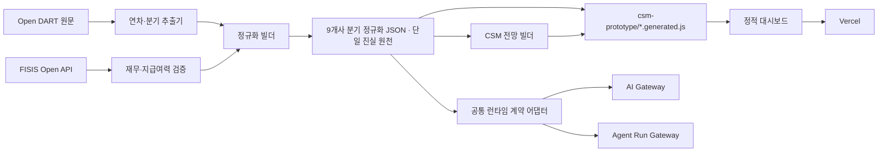

# CSM Lens

국내 주요 보험사의 IFRS17 CSM을 Open DART 원문에서 수집·정규화하고, FISIS와 회사 공식 자료로 검증한 뒤 업권 비교와 Base/Worst 전망을 제공하는 정적 대시보드다.

- 운영 대시보드: <https://3csm.vercel.app/csm-prototype/index.html>
- 현재 최신 실적: 2026년 1분기
- 연도말 실적 범위: 2022~2025년
- 분석 대상: 생명보험 4개사 + 손해보험 5개사
- 프론트엔드: HTML/CSS/Vanilla JavaScript
- 데이터 처리: Python 결정론적 파서·빌더
- 배포: Vercel 정적 배포

이 문서는 다른 LLM 또는 개발자가 현재 시스템을 이어서 작업할 때 가장 먼저 읽어야 하는 인수인계 문서다. 데이터 세부 기준은 [DATA_METHODOLOGY.md](DATA_METHODOLOGY.md), 전망 산식은 [CSM_FORECAST_METHODOLOGY.md](CSM_FORECAST_METHODOLOGY.md)를 함께 읽는다. `docs/` 아래 2026년 6월 문서는 초기 파일럿 설계 기록이므로 현재 구현과 충돌하면 이 문서와 두 방법론 문서를 우선한다.

## 1. 시스템 목적

CSM Lens의 목적은 다음 두 가지다.

1. 보험업계의 보유 CSM, 신계약 CSM, 보험손익, K-ICS와 CSM Movement를 동일한 기준으로 비교한다.
2. 검증된 과거 Movement와 증권사 애널리스트 자료를 근거로 보유 CSM의 Base/Worst 전망을 제시한다.

대시보드의 숫자는 계리·경영진 보고를 보조하기 위한 값이다. 회사의 공식 가이던스, 내부 결산값 또는 투자 추천을 의미하지 않는다. 출처, 기준, 산식과 검증 상태를 숫자와 함께 보존하는 것이 제품의 핵심 원칙이다.

## 2. 분석 대상 회사

| 업권 | 회사 키 | 회사명 |
| --- | --- | --- |
| 생보 | `samsung-life` | 삼성생명 |
| 생보 | `hanwha-life` | 한화생명 |
| 생보 | `kyobo-life` | 교보생명 |
| 생보 | `shinhan-life` | 신한라이프 |
| 손보 | `samsung-fire` | 삼성화재 |
| 손보 | `meritz-fire` | 메리츠화재 |
| 손보 | `db-insurance` | DB손해보험 |
| 손보 | `hyundai-marine` | 현대해상 |
| 손보 | `kb-insurance` | KB손해보험 |

회사 키는 Python 산출물, 생성 JavaScript와 프론트엔드에서 동일하게 사용한다. 새 회사를 추가할 때는 파서의 회사 메타데이터, 데이터 계약, 프론트의 `companyCatalog`, 테스트를 함께 수정해야 한다.

## 3. 대시보드 화면 구조

각 좌측 탭은 하나의 독립 본문 페이지와 연결된다.

| 번호 | 화면 | 핵심 기능 |
| --- | --- | --- |
| 01 | 업권 현황 | 보유 CSM·신계약 CSM·보험손익·K-ICS 회사 비교 |
| 02 | CSM Movement | 9개사 숫자표와 실제 공시값 기반 Movement 흐름 |
| 03 | CSM 추이 | 과거 연도말/최신 분기 실적과 1·2·3·5·10년 Base/Worst 전망 |
| 04 | 보험부채 변동내역 | 계리적 가정 변경의 BEL·RA·CSM 영향; 연말에만 표시 |
| 05 | 예실차 | 기본값은 별도 SAP 관리기준 종합·보험금·사업비 예실차 비율. 상단 기준기간에 맞는 최신 연말의 전기·당기를 표시하고, 전체보기에서 금액·비율·전년비 확인. 공시기준 전환 시 DART 공시표 |
| 06 | 경과기간 손해율 | 회사별 경과기간 비율, 미니 흐름, 전체 공시표 |
| 07 | 경과기간 유지비율 | 회사별 경과기간 비율, 미니 흐름, 전체 공시표 |
| 08 | 데이터 기준 | 원본, 파싱 규칙, 검증값, 허용오차, 선택 데이터 감사 이력 |

생보와 손보는 카드·그래프·표에서 별도 그룹으로 표시한다. 표에서는 업권 셀을 회사마다 반복하지 않고 행 그룹으로 묶는다.

## 4. 핵심 데이터 기준

### CSM과 Movement

- 원본: Open DART 사업·분기·반기보고서 재무제표 주석
- 기준: 별도재무제표, 발행 보험계약, 출재 재보험 제외
- 저장 단위: 십억원
- 표준 산식:

```text
기말 CSM = 기시 CSM + 신계약 CSM + 이자부리 + CSM 조정 등 + CSM 상각
```

`CSM 상각`은 음수로 저장한다. Movement 화면의 항목 순서는 회사 IR 장표와 동일하게 유지한다.

### 누적/분기 기준

- `누적 기준`: 기시는 전년도말이며 당해연도 누적 Movement와 누적 손익을 표시한다.
- `분기 기준`: 기시는 전분기말이며 누적 공시에서 직전 누적을 차감한 분기 단독 Movement와 손익을 표시한다.
- 보유 CSM과 K-ICS는 시점값이므로 두 기준에서 동일하다.

### 보험손익·순이익·지급여력

- DART 원본을 저장한다.
- FISIS는 보험손익·순이익·K-ICS/RBC 검증과 일부 DART 공백의 명시적 대체에 사용한다.
- 연결/별도처럼 기준이 다르면 억지로 일치시키지 않고 차이를 메타데이터에 기록한다.
- K-ICS는 원본 소수점을 보존하고 화면에서 정수로 반올림한다.

### 예실차 관리기준

- 기본 화면은 각 보험사 홈페이지의 결산 경영공시 중 별도 SAP 손익계산서 기준이다. 현재 수록 연말은 2024·2025년이다.
- 관리기준도 공시기준과 같은 연말 선택 규칙을 사용한다. 2025년말을 기준으로 하면 2024년 전기·2025년 당기를, 2024년말을 기준으로 하면 2023년 전기는 `—`로 두고 2024년 당기만 표시한다. 존재하지 않는 연도 값은 추정하지 않는다.
- 분기 선택 시에는 연말 전용 공시지표 규칙에 따라 1~3분기는 직전 연말, 4분기·연말은 해당 연말 데이터를 표시한다.
- 종합 예실차는 보험금 예실차와 사업비 예실차를 합산한다. 본문은 `종합 → 보험금 → 사업비` 순서로 전기·당기 비율만 보여준다.
- 보험금 예실차는 `예상보험금 - (발생보험금 + 발생사고요소조정)`으로 계산한다.
- 사업비 예실차는 예상 손해조사비·계약유지비·투자관리비 합계에서 같은 발생 항목 합계를 차감한다.
- 비율은 각 예실차를 대응하는 예상금액으로 나누며 종합 비율은 예상보험금과 예상사업비 합계를 분모로 사용한다.
- `전체보기`는 선택된 연말의 전기·당기·전년비를 나란히 두고 종합 예실차, 보험금 구성항목, 사업비 구성항목의 금액과 비율을 표시하며 Excel 다운로드를 지원한다.
- 삼성생명·한화생명·삼성화재·메리츠화재·DB손해보험·현대해상은 공식 SAP 팩트시트의 2024·2025 세부 행을 직접 재계산한다.
- 교보생명·신한라이프·KB손해보험은 공개 경영공시의 공식 결과값을 사용한다. 회사가 세부 예상금액 분모를 공개하지 않은 비율은 임의 추정하지 않고 `분모 미공개`로 둔다.
- 현대해상은 팩트시트 요약 `Expense differences`에 포함된 기타 보험서비스비용을 제외하고, 사용자 산식의 예상 사업비 합계에서 실제 사업비 합계만 차감한다.
- 요청된 업무상 ±5% 관리 참고선은 화면에 안내하되 예상금액 분모가 공개되지 않은 회사는 충족 여부를 임의 판정하지 않는다.
- `ref_data`는 원본·검증값으로 사용하지 않는다.
- 저장 계약은 `external-data/management-experience-2025.json`, 브라우저 생성물은 `csm-prototype/management-experience-data.generated.js`다. 회사·연도별 결과금액, 비율, 구성항목, 공식 URL, 문서·시트·행 위치, 검증등급과 결측 사유를 함께 저장한다.
- 갱신할 때는 공식 도메인과 결산연도 확인 → 별도 SAP 표 탐지 → 원단위·부호 정규화 → 구성항목 항등식과 비율 재계산 → 공개범위 등급 부여 → JSON·브라우저 생성물 동등성 테스트 순서로 처리한다. 상세 체크는 `DATA_METHODOLOGY.md`의 `예실차 · 관리기준`을 따른다.
- 다음 결산 갱신을 위한 필드 계약·검증등급·회사별 예외·체크리스트는 [`docs/management-experience-standard.md`](docs/management-experience-standard.md)에 별도로 고정한다.

### 연말 전용 공시지표

예실차의 `공시기준`, 경과기간별 손해율·유지비율, 보험부채 변동내역은 Open DART 연결재무제표 주석에서 연말 기준으로만 읽는다. 현재 동일한 상세 공시는 2024년말부터 확인된다. 분기 선택 시에는 선택 기간 이전의 최신 연말 공시를 표시하고, 화면 라벨에 실제 표시 연말을 노출한다.

공시기준 예실차와 경과기간별 손해율·유지비율, 보험부채 변동내역의 `전체보기` 표는 상단 `Excel 다운로드` 버튼으로 실제 `.xlsx` 파일을 생성한다. 병합된 화면 헤더는 분석 가능한 평면 열로 펼치고 숫자와 백분율은 Excel 숫자 셀로 저장한다.

### `ref_data` 금지 원칙

`ref_data/`의 사내 참고 엑셀은 화면 형태와 업무 맥락을 이해하기 위한 정적 참고자료일 뿐이다.

- 원본 소스로 사용하지 않는다.
- 검증값으로 사용하지 않는다.
- 후보표 선택 또는 품질 통과 기준으로 사용하지 않는다.
- Git 저장소와 Vercel 배포에서 제외한다.

## 5. 전망 모델

전망 데이터는 `tools/build_csm_forecast.py`가 생성한다.

### 표시 시점

| 명칭 | 표시 연도 |
| --- | --- |
| 1년 전망 | 2026년말 |
| 2년 전망 | 2027년말 |
| 3년 전망 | 2028년말 |
| 5년 전망 | 2030년말 |
| 10년 전망 | 2035년말 |

2029년과 2031~2034년은 화면에는 보이지 않지만 전년도 기말을 다음 연도 기시로 연결하기 위해 내부적으로 계산한다.

### Base

- 전년 Q2~Q4 계절성, 당해 Q1 성장 신호, 최근 최대 3개년 조정률 중앙값을 데이터 모델의 기준값으로 사용한다.
- 회사별 직접 근거가 있는 경우에만 **증권사 소속 애널리스트 보고서** 판단을 25% 오버레이한다.
- 뉴스 기사, 포털 기사, 회사 보도자료와 일반 연구기관 전망은 전망 입력으로 사용하지 않는다.
- 이자부리와 상각은 최근 실적의 `(기시 CSM + 신계약 CSM)` 대비율을 적용한다.
- 2024·2025년 Q1 시점 연말 예측을 9개사에 롤링 백테스트하고 회사별 MAPE로 신뢰도를 산정한다.

### Worst

Worst는 경영진이 같은 기준으로 비교할 수 있도록 전 보험사에 동일한 단순 하방률을 적용한다.

- 신계약 CSM: Q2~Q4 잔여 신계약 전망을 최종 Base 대비 10% 감소
- CSM 조정: Q2~Q4 잔여 조정을 최종 Base 대비 10% 악화. 경영목표 연결분이 있으면 이를 포함한 최종 Base 조정액에서 계산
- 1분기 확정 실적은 낮추지 않고, 이자부리·상각은 스트레스된 CSM 규모에 맞춰 재계산

롤링 백테스트 54건은 Worst 하방률 산식이 아니라 모델 신뢰도와 검증 제한 라벨을 산정하는 참고 표본으로 보존한다.
- 이자부리·상각: 스트레스 이후 CSM 규모에 기존 기계 비율을 다시 적용

상세 팝업은 1~3년, 5년, 10년 전망 근거를 임원보고용 짧은 문장으로 표시하고, 하단에 회사별 판단 근거와 사용한 애널리스트 보고서를 연결한다.

## 6. 아키텍처와 데이터 흐름



숫자 추출, 단위 변환, 기간 환산, Movement 검산과 전망 산식은 결정론적 코드로 수행한다. LLM은 문서 이해, 후보표 검토, 정성 근거 정리와 설명 문장 작성에만 사용하며 출처 없는 숫자를 확정하면 안 된다.

## 7. 디렉터리와 주요 파일

```text
.
├── README.md                         # 현재 시스템 인수인계 문서
├── DATA_METHODOLOGY.md               # 데이터 수집·파싱·검증 상세 기준
├── docs/management-experience-standard.md # 관리기준 예실차 갱신 표준
├── CSM_FORECAST_METHODOLOGY.md       # Base/Worst 전망 상세 산식
├── csm-prototype/
│   ├── index.html                    # 8개 페이지와 모달 마크업
│   ├── styles.css                    # 전체 UI/반응형 스타일
│   ├── script.js                     # 상태, 렌더링, 차트, 모달, 데이터 기준
│   ├── dashboard-data.generated.js   # 연차+분기 CSM/손익/K-ICS
│   ├── forecast-data.generated.js    # 9개사 Base/Worst 전망
│   ├── assumption-data.generated.js  # 예실차·손해율·유지비율
│   └── liability-assumption-data.generated.js
├── external-data/                    # 정규화 JSON과 검증 메타데이터
├── tools/                            # DART/FISIS 추출기와 결정론적 빌더
│   └── dashboard-contract.mjs        # 9개사 JSON의 AI/Agent 공통 런타임 계약
│   └── forecast-contract.mjs         # UI·AI·Agent Run 공통 전망 계약/검산
├── tests/                            # Node/Python 회귀검증
├── docs/                             # 초기 설계·에이전트 문서(일부는 역사 문서)
├── vercel.json                       # 루트를 대시보드로 리다이렉트
└── .env.example                     # 필요한 환경변수 이름만 기록
```

### 생성 데이터 연결

| 정규화 JSON | 브라우저 로드 파일 | 생성기 |
| --- | --- | --- |
| `csm-quarterly-dashboard-data.json` | `dashboard-data.generated.js` | `build_quarterly_dashboard_data.py` |
| `csm-forecast-2026.json` | `forecast-data.generated.js` | `build_csm_forecast.py` |
| `insurance-assumption-dashboard-data.json` | `assumption-data.generated.js` | `build_assumption_dashboard_data.py` |
| `liability-assumption-dashboard-data.json` | `liability-assumption-data.generated.js` | `build_liability_assumption_data.py` |

생성 JavaScript는 JSON을 `window.CSM_*` 전역에 넣는 정적 데이터 번들이다. 프론트에서 값을 직접 고치지 말고 가능하면 원본 JSON/빌더를 수정한 뒤 다시 생성한다.

`external-data/csm-quarterly-dashboard-data.json`은 분기 실적의 단일 진실 원천이고, `external-data/csm-forecast-2026.json`은 전망의 단일 진실 원천이다. 화면, AI Gateway, Agent Run Gateway는 각각 `tools/dashboard-contract.mjs`와 `tools/forecast-contract.mjs`를 통해 같은 값을 읽고 검산한다. `external-data/csm-dashboard-agent-output.json`은 이전 2개사 파일럿 보존물이며 현재 런타임 입력으로 사용하지 않는다.

## 8. 환경 설정

루트에 `.env.example`을 복사해 `.env`를 만들고 키를 입력한다. `.env`는 Git에 커밋하지 않는다.

```bash
cp .env.example .env
```

필수 변수:

```text
API_K_DART=Open DART API 키
API_FISIS=FISIS Open API 키
```

AI 게이트웨이 실험을 사용할 때만 `BIZROUTER_API_KEY` 또는 게이트웨이 관련 변수가 추가로 필요하다. 어떤 생성 산출물에도 API 키를 기록하지 않는다.

Python은 3.11 이상을 권장하며 현재 파서는 `lxml`을 사용한다. 프론트와 테스트는 Node.js 20 이상을 권장한다.

## 9. 데이터 갱신 절차

아래 명령은 저장소 루트에서 실행한다. 대량 Open DART 호출 전에는 회사 1개·기간 1개로 먼저 확인하는 것이 안전하다.

### 9.1 연도말 CSM 및 재무지표

```bash
python tools/annual_dart_insurance_extract.py
python tools/fisis_hanwha_validation.py
python tools/fisis_life_validation.py
python tools/fisis_meritz_validation.py
python tools/build_annual_dashboard_data.py
```

연차 추출기는 현재 2022~2025년과 9개사를 대상으로 한다. 새 연도가 공시되면 `YEARS`, 표 선택 규칙과 검증값을 함께 갱신해야 한다.

### 9.2 분기 CSM 및 손익

전체 신규 수집:

```bash
python tools/quarterly_dart_insurance_extract.py --fresh
python tools/quarterly_fisis_financial_extract.py
python tools/build_quarterly_dashboard_data.py
```

회사·기간 단위 재수집 예시:

```bash
python tools/quarterly_dart_insurance_extract.py --company samsung-life --period 2026-q1
```

분기 빌더는 누적값과 분기 단독값을 함께 보존하고 다음 항목을 검사한다.

- Movement 항등식
- 전분기 기말과 다음 분기 기시 연속성
- 분기 단독값 합계와 연간 누적값
- DART/FISIS 보험손익·순이익 차이

### 9.3 전망

분기 정규화 데이터 생성 후 실행한다.

```bash
python tools/build_csm_forecast.py
```

새로운 애널리스트 근거를 추가할 때는 URL, 제목, 반영 항목과 `type: sell_side`를 함께 저장한다. 뉴스나 보도자료가 섞이면 생성기가 실패해야 한다.

### 9.4 예실차·경과기간 비율

2024·2025년 Open DART 연결 주석 후보표를 생성하고 정규화한다.

```bash
python tools/extract_dart_assumption_metrics.py --year 2024 --output external-data/dart-assumption-metrics-2024.json
python tools/extract_dart_assumption_metrics.py --year 2025 --output external-data/dart-assumption-metrics-2025.json
python tools/build_assumption_dashboard_data.py \
  --dart-json external-data/dart-assumption-metrics-2025.json \
  --dart-prior-json external-data/dart-assumption-metrics-2024.json
```

### 9.5 보험부채 변동내역

최초 공시시점 감사 때문에 2022~2025년 후보 파일이 필요하다.

```bash
python tools/extract_dart_assumption_metrics.py --year 2022 --output external-data/dart-assumption-metrics-2022.json
python tools/extract_dart_assumption_metrics.py --year 2023 --output external-data/dart-assumption-metrics-2023.json
python tools/extract_dart_assumption_metrics.py --year 2024 --output external-data/dart-assumption-metrics-2024.json
python tools/extract_dart_assumption_metrics.py --year 2025 --output external-data/dart-assumption-metrics-2025.json
python tools/build_liability_assumption_data.py
```

`SELECTED_CANDIDATES`는 사람이 Open DART 원문을 확인한 표 인덱스다. 새 연도에는 후보 표 제목, 범위, 단위와 합계 검산을 확인한 뒤 인덱스를 갱신한다.

## 10. 검증과 테스트

대시보드 변경 후 최소 검증:

```bash
python -m py_compile tools/*.py
node --check csm-prototype/script.js
node --test tests/*.test.mjs
node --test tests/test_ai_gateway_contract.mjs tests/test_agent_run_gateway.mjs
python tools/test_quarterly_dashboard_data.py
```

현재 핵심 Node 테스트는 다음을 검증한다.

- 9개사와 생보/손보 그룹 구조
- 각 탭이 독립 페이지로 동작하는 정보구조
- Movement 항등식과 누적/분기 기준
- CSM 전망의 Base/Worst 산식, 1·2·3·5·10년 표시 시점
- 예실차·손해율·유지비율 계산과 연말 표시
- 보험부채 변동내역의 DART 출처 추적
- 데이터 기준 화면의 원본·검증 방법 노출
- 화면·AI·Agent Run이 같은 9개사 분기 계약과 스냅샷 해시를 사용하는지 여부

데이터 또는 산식을 바꾸면 관련 JSON과 생성 JavaScript를 모두 다시 만들고 테스트를 통과시킨다.

## 11. 로컬 실행

정적 대시보드만 확인할 때:

```bash
python -m http.server 8765
```

브라우저:

```text
http://127.0.0.1:8765/csm-prototype/index.html
```

Agent Run/AI Gateway 런타임까지 확인할 때는 다음 서버를 사용한다.

```bash
node tools/preview-server.mjs
```

현재 운영 대시보드는 정적 기능이 중심이다. `preview-server.mjs`의 AI와 Agent Run은 같은 9개사 분기 계약을 읽는다. Agent Run은 실시간 DART 재수집이 아니라 이미 적재된 Open DART/FISIS 기반 스냅샷을 재검산하는 `snapshot_revalidation` 실행이다.

## 12. 배포

Vercel 프로젝트는 루트의 `.vercel/project.json`에 로컬 연결되어 있다. 일반 배포 명령:

```bash
vercel --prod --yes
```

배포 후 확인 항목:

1. `https://3csm.vercel.app/csm-prototype/index.html` 응답
2. 8개 탭의 독립 페이지 전환
3. 9개사 카드와 표 렌더링
4. CSM 추이 상세 팝업의 1·2·3·5·10년 Base/Worst 값
5. 데이터 기준 탭의 출처·검증 설명
6. 브라우저 콘솔 오류 유무

`.vercelignore`는 원시 데이터, 도구, 테스트와 내부 문서를 배포물에서 제외한다. 대시보드가 필요한 데이터는 `csm-prototype/*.generated.js`에 포함된다.

## 13. 다른 LLM이 작업할 때 지켜야 할 규칙

1. 숫자를 직접 HTML/JavaScript에 하드코딩하기 전에 해당 생성기와 정규화 JSON을 찾는다.
2. CSM 원본은 Open DART를 사용한다. `ref_data`를 원본이나 검증값으로 사용하지 않는다.
3. 출처 없는 숫자, 기사에서 본 숫자 또는 LLM 추정값을 실적으로 확정하지 않는다.
4. 원본값, FISIS 검증값, 계산값, 전망값을 데이터 계약에서 구분한다.
5. 연결/별도, 발행/재보험, 누적/분기, 단위를 항상 함께 기록한다.
6. Movement 차이를 조정에 조용히 흡수하지 말고 감사 메타데이터에 남긴다.
7. 사용자·담당자 확정 전망은 출처 상태와 모델 대비 보정액을 기록한 Base 앵커로 우선 적용하고, 전망 외부 근거는 증권사 애널리스트 보고서만 사용한다.
8. Worst 신계약과 조정은 전 보험사 공통 하방률(신계약 CSM -10%, CSM 조정 10% 악화)을 사용하고 회사별 임의 숫자로 바꾸지 않는다.
9. UI 변경 시 생보/손보 그룹, 표 정렬, 팝업 전체보기, 독립 탭 구조를 유지한다.
10. 변경 후 생성물 재생성, 자동 테스트, 운영 화면 검증을 수행한다.

## 14. 현재 알려진 한계와 다음 작업

- 일부 회사·시점은 공식 IR 검증값이 없어 DART 내부 항등식과 기간 연속성이 주 검증 수단이다.
- 연차·분기 표 선택 규칙에는 회사·연도별 예외가 남아 있어 새 공시 때 후보표 검토가 필요하다.
- 담당자 확정 Base 앵커의 셀프서비스 입력 UI는 아직 없다. 현재 삼성생명 2026년말 목표 13.5조원은 생성기 설정값으로 관리하며 모델값과의 차이를 감사 메타데이터에 남긴다.
- 회사별 직접 애널리스트 보고서가 없는 회사는 정성 오버레이를 적용하지 않는다.
- 현재 정적 운영 화면에는 AI 패널과 Agent Run 패널이 연결되어 있지 않으며 로컬 preview API로만 검증한다.
- 완전한 에이전트화 시에는 수집 → 후보표 탐지 → 검산 → Human Review → 승인 스냅샷 배포의 실행 이력을 영속 저장해야 한다.

## 15. 변경 작업 체크리스트

```text
[ ] 원본과 기준을 확인했다.
[ ] 파싱·검증 방법을 DATA_METHODOLOGY.md에 기록했다.
[ ] 생성기와 정규화 JSON을 수정했다.
[ ] 생성 JavaScript를 다시 만들었다.
[ ] Movement/기간/단위 검산을 통과했다.
[ ] Node/Python 테스트를 통과했다.
[ ] 대시보드 데이터 기준 화면을 갱신했다.
[ ] API 키·임시파일·ref_data가 Git에 포함되지 않았다.
[ ] Vercel 배포 후 운영 화면을 확인했다.
```
